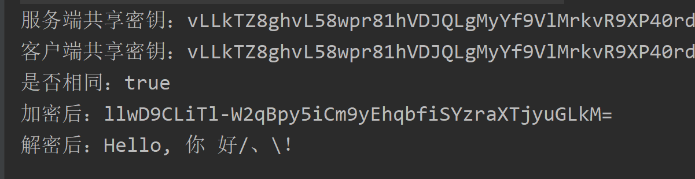

# DH Key Agreement

## Introduce

The client end and server level generate their own `RSA` key pairs and exchange public keys, using `Diffie Hellman`.
The algorithm uses its own private key and the other party's public key, and the client end and server level will generate the same `AES` symmetric encryption key,
Later, the client end and the server verify the negotiated key, and the successful verification uses the `AES` key to add to decipher, because the key has never been exposed on the network, so it is safe.

## Negotiation process

To use DH key negotiation, the backend needs to use SecureApi to set the encryption mode to `common` and specify the encryption algorithm as `AES`, which cannot be other algorithms, because DH
The negotiated key is the key of `AES`.

> - The backend uses `CipherUtils` or an online website to generate a `RSA` key pair and save it on the server, waiting for the front-end negotiation signal
> - The first communication: the front-end generates the `RSA` key pair, then sends a request for the negotiated key to the back-end, and sends the public key to the front-end (the public key is transmitted on the network, and will be checked later). After the backend receives the request, it uses its own private key and the public key sent from the front-end to generate a `negotiated key` and save it in the `key` field of the `SecureApiPropertiesConfig`, and then returns its own public key to the front-end. After the front-end gets the backend public key, it also uses this public key and its own private key to generate a `negotiated key`
> - Second communication: The front end uses the `negotiation key` to encrypt an arbitrary data and send it to the backend. The backend sees if the `negotiation key` can be used to successfully decipher. If it succeeds, the negotiation is successful. The subsequent front and back ends use the `negotiation key` to add to decipher. If the decipher fails, in addition to the code reason, it may be that the `public key` was tampered with during transmission. At this time, it needs to be renegotiated
> - After the negotiation is successful, the front and back ends each have the same symmetric key, which can be used to add a decipher later. This key has never been exposed on the network, so it is safe. You can also renegotiate regularly to enhance security

## Advantage

- Security, although it is still a little worse than the `session-key` mode, the negotiation process is simpler than the `session-key` mode
- Compared with the `session-key` mode, each request has one less calculation of the `RSA` private key decipher session key, and the performance is higher (do not underestimate the performance consumption of the private key decipher)

## DiffieHellmanUtils

SecureApi provides a tool class for DH key negotiation: `DiffieHellmanUtils`, the following is an introduction to the method of the tool class.

```java
public static void main(String[] args) {
    // The backend generates a DH key pair and sends the public key to the frontend
    KeyPair serverKeyPair = DiffieHellmanUtils.getDhKeyPairs();
    
    // The front end generates the key pair and sends the public key to the backend.
    KeyPair clientKeyPair = DiffieHellmanUtils.getDhKeyPairs();
    
    // The backend generates a negotiated key based on its own private key and the frontend public key
    String serverSharedSecretString = DiffieHellmanUtils.createSharedSecret(serverKeyPair.getPrivate(), clientKeyPair.getPublic());
    // The front end generates a negotiated key based on its own private key and the backend public key
    String clientSharedSecretString = DiffieHellmanUtils.createSharedSecret(clientKeyPair.getPrivate(), serverKeyPair.getPublic());
    
    System.out.println("Server shared key：" + serverSharedSecretString);
    System.out.println("Client shared key：" + clientSharedSecretString);
    System.out.println("Is it the same: " + clientSharedSecretString.equals(serverSharedSecretString));
    
    // 使用共享密钥加密
    String content = "Hello, 你 好/、\\！";
    CipherUtils cipherUtils = new CipherUtils(CipherAlgorithmEnum.AES_ECB_PKCS5);
    String encrypt = cipherUtils.encrypt(content, serverSharedSecretString);
    System.out.println("After encryption: " + encrypt);
    // 使用共享密钥解密
    System.out.println("After decryption: " + cipherUtils.decrypt(encrypt, serverSharedSecretString));
}
```



## Explain

The essence of DH key agreement is to save a key for each front and back end, but to enhance the flexibility, SecureApi still uses the `common` mode, and the negotiated key is set to the `key` field of the `SecureApiPropertiesConfig` when configuring SecureApi.
