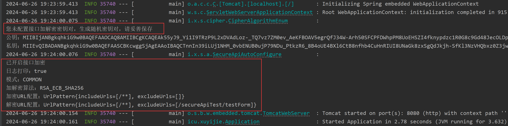
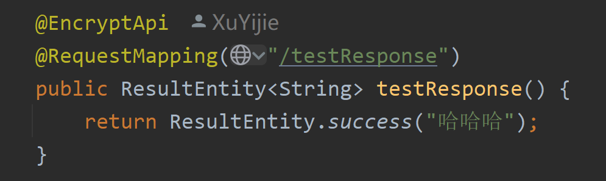
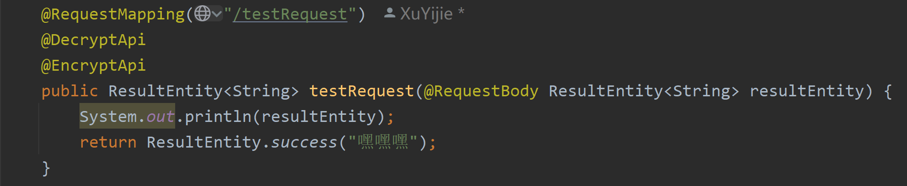
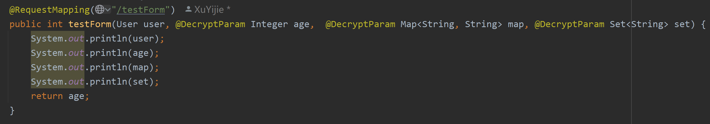
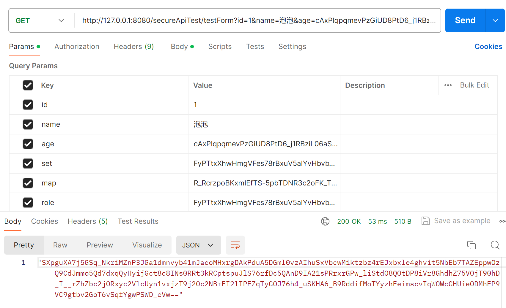

# Try It

> Okay, bosses, here it is, the configuration is completed, and then the effect experience can be carried out. The demo of the front and back ends will be provided when there is time later.

::: warning
This article is just to experience the function first, please be sure to be the same as my code, otherwise you may encounter some problems. The annotations used in the code will be introduced in subsequent pages to solve your doubts.
:::

## Launch project

> When the `enable` of SecureApi is set to `true`, the console will print the following information, indicating that the interface plus decipher function is enabled. I did not specify the key here, so the component automatically generates it for me. Then you can set the key to the front end or negotiate a key with the front end to pursue a more secure transmission.
>
> It is recommended to use `CipherUtils` to manually set the key during testing, and you can specify `seed` to ensure that the generated key is the same every time, which is more convenient.

## Return value encryption

> We did not match the configuration url before. We need to add the `@EncryptApi` annotation on the interface or the class where the interface is located to implement the return value encryption.

> You can see that since I turned on the log printing function, the console prints out some information.

> The interface returns a json character string, and then the front-end uses the corresponding key to decipher the character string (note that this is a json character string, the front-end processing should remove the quotes at the front and rear ends) to get `{"code":200,"message":"哈哈哈","data":null}` object.

## Parameter decrypt

### Body parameter decrypt

> Component can decipher the json parameter body. This time we pass in the encrypted return value in the previous step to take a look at the decipher result. The interface needs to add the `@DecryptApi` annotation, so that this interface will not only decipher the parameter, but also encrypt the return value.

> You can see that the ciphertext parameter is normally deciphered to `{"code":200,"message":"哈哈哈","data":null}`, the return value was also successfully encrypted.

### Param and form-data parameter decrypt

> This time we are a little more complicated. All kinds of parameters are integrated, and there is no URL matching enabled. We need to add the `@DecryptParam` annotation to the field. Note that `@DecryptParam` cannot be used at the same time as `@RequestParam`. `@DecryptParam` has replaced the latter function.

> The entity class itself does not need to be annotated, but should be added to the fields inside. Note that fields without annotations will not be decrypted (if the configuration url matches, all fields will be decrypted without annotations)

> Send the request. The ciphertext in the request is generated by me in advance with code(Attention，The ciphertext in the param should be url safe). It is possible to send these parameters in `param` or `form-data`.

> Successfully decipher the annotated parameters, no annotated and empty parameters are not decrypted

## Summary

> Regarding the use of the `@DecryptApi` `@EncryptApi` `@DecryptParam` annotation, please see the next article [Annotation]

[Annotation]: annotation
