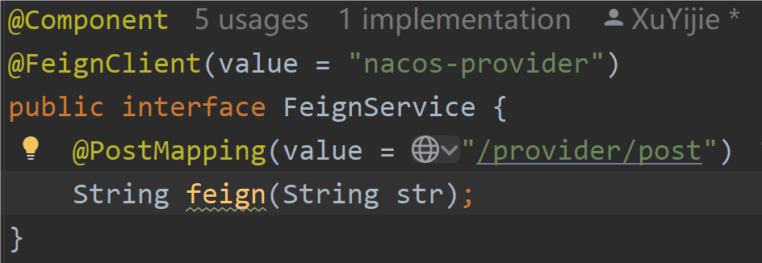

# 微服务调用

- 微服务一般使用 `Dubbo` 或者 `OpenFeign` 进行远程调用，如下方那样对吧，直接调用接口方法就可以调用其他微服务模块

- 目前 SecureApi 不能自动对 interface 方法上的参数进行加密，调用方需要手动加密参数后发送请求，也就是 @Autowired 注入 SecureApi 提供的 `CipherUtils` 手动加密 str ，然后调用 "feign" 方法把加密的 "str" 传进去。

- 然后被调用方也引入 SecureApi ，微服务各模块设置 *相同* 的加密模式和 key，被调用方那边就不需要手动操作了，参数解密和返回值加密都会是自动化的

::: warning
也就是说目前调用方需要手动加密参数，后续版本会增加对微服务调用自动加密参数的支持，开发中...
:::
