# 试一下

> 好了各位大佬们，到了这里，配置以及完成，接下来可以进行效果体验了，后面有时间会提供前后端的 demo。

::: warning
本篇只是先体验功能，请务必和我的代码相同，不然也许你会遇到一些问题，代码里使用的注解等后续篇幅会介绍，可以解决你的疑惑。
:::

## 启动项目

> SecureApi的 `enable` 设置为 `true` 时，控制台会打印以下信息，代表开启接口加解密功能，我这里没有指定 key ，所以组件为我自动生成了，然后你可以把密钥设置到前端或者和前端进行密钥协商以追求更安全的传输。
>
> 建议测试的时候使用 `CipherUtils` 手动设置密钥，可以指定 `seed` 保证每次生成的密钥相同，更加方便。

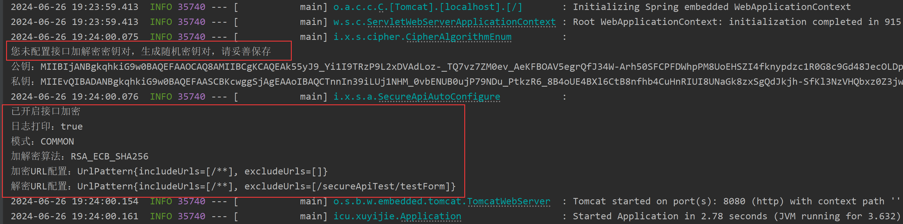

## 返回值加密

> 前面我们没有配置url匹配，需要在接口上或者接口所在类上添加 `@EncryptApi` 注解，即可实现返回值加密

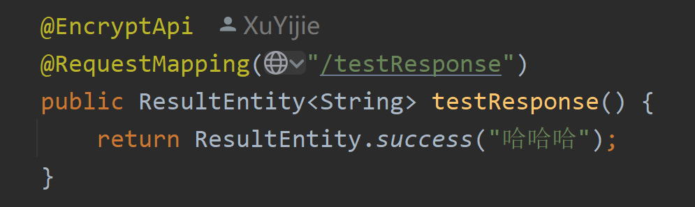

> 可以看到由于我开启了日志打印功能，控制台打印出一些信息

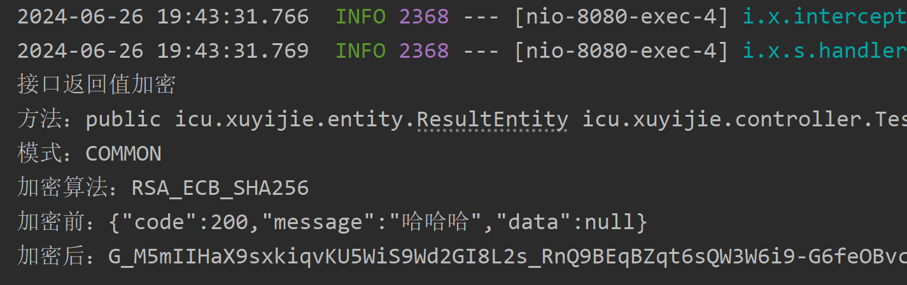

> 接口返回的是一个json字符串，然后前端使用对应密钥解密这个字符串（注意这是个json字符串，前端处理时应该去除前后两端引号）就可以拿到 `{"code":200,"message":"哈哈哈","data":null}` 这样的对象了

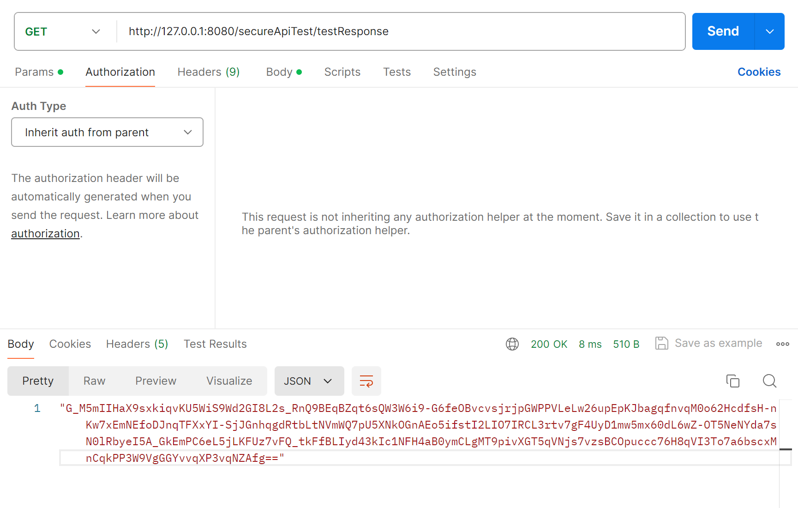

## 参数解密

### Body参数解密

> 组件可以对json参数体进行解密，这次我们传入上一步中加密的返回值，看一看解密结果，接口需要添加 `@DecryptApi` 注解，这样这个接口既会解密参数，也会加密返回值

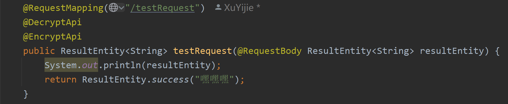

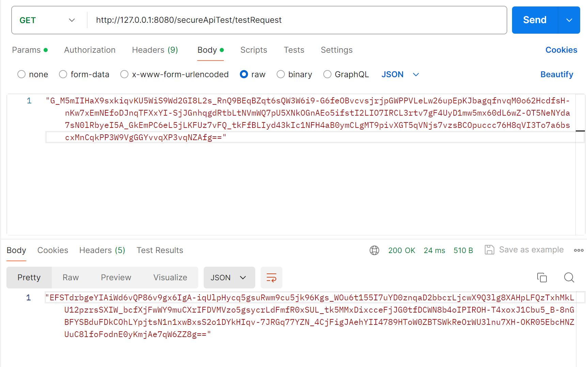

> 可以看到密文参数正常解密为 `{"code":200,"message":"哈哈哈","data":null}`,返回值也成功加密了

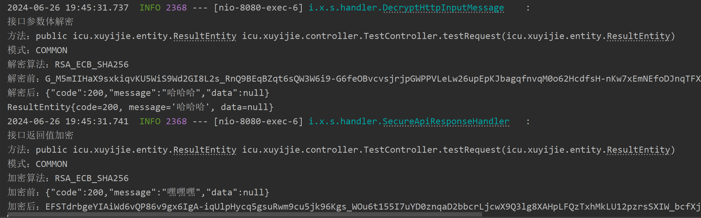

### param和form-data参数解密

> 这一次我们整复杂一点，各种类型的参数都整上，没有开启url匹配，我们要给字段加上 `@DecryptParam` 注解，注意 `@DecryptParam` 不能和  `@RequestParam` 同时使用，`@DecryptParam` 已经替代了后者功能。

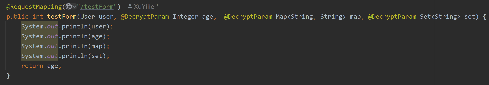

> 实体类本身不需要加注解，要加在里面的字段上，注意，没有加注解的字段不会解密（配置了url匹配的话，加不加注解全部字段都会解密）

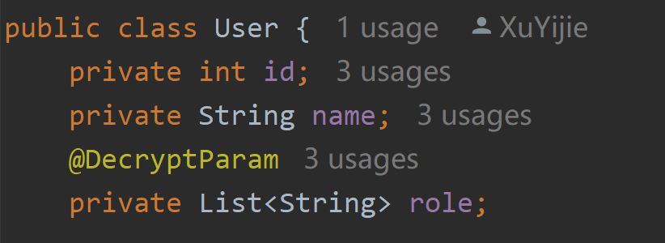

> 发送请求，请求中这些密文都是我提前用代码生成好的（注意，param里的密文要是url safe的），这些参数放在 `param` 里或者放在 `form-data` 里发送都是可以的

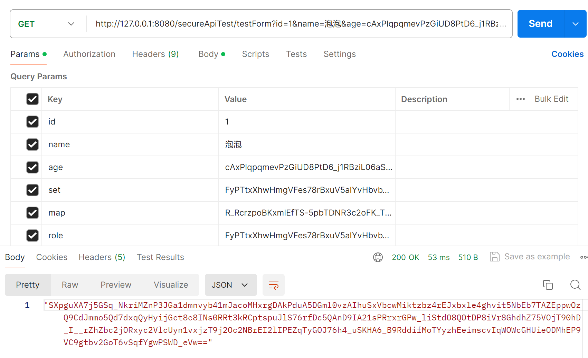

> 成功解密加了注解的参数，没有加注解和为null的参数不解密

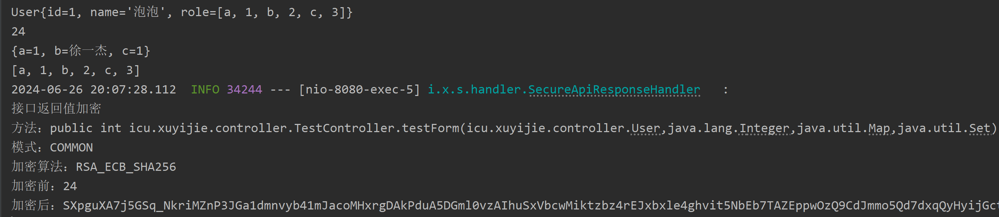

## 总结

> 关于 `@DecryptApi` `@EncryptApi` `@DecryptParam` 注解的使用，请看下篇 [注解]

[注解]: 注解
